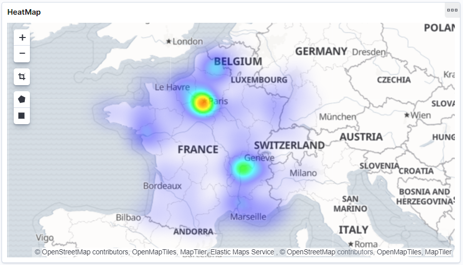

# SNCF disruptions visualization

This personal project aims to visualize disruptions on french railway network, using open data provided by SNCF.
Technology used are Typescript and ElasticSearch.

## Setup

The project requires node version > 10.0 and a running Elasticsearch instance.

```
npm install
npm install -g typescript
```

Compile the project :
```
tsc
```

Set your `env.json` file using `env.example.json` template. And setup your elasticsearch cluster with :
```
node dist/src/setup.js
```

Then run to import disruptions from the day set in `env.json` :
```
node dist/src/import.js
```

## Visualizations

Visualizations were made using Kibana 7.0. My visualizations can be imported in *Management > Saved Objects > Import* using the file `visualization/export.json`.

Here is a quick overview of what is possible :

  



## Todo

- [x] Loop through SNCF disruptions.
- [x] Create ElasticSearch mapping.
- [x] Insert disruptions in ElasticSearch.
- [x] Create environment file.
- [x] Visualize in Kibana.
- [ ] Fix bug with delay overlapping two days and undefined `base_departure_time`.
- [ ] List all trains running
- [ ] Visualize figures relative to train frequency to better grasp which lines have highest disruption rates.
- [ ] Generate dataset of trains labeled by if there was a disruption or not.
- [ ] Build logistic regression model to get disruptions contributing factors and predict disruptions.
